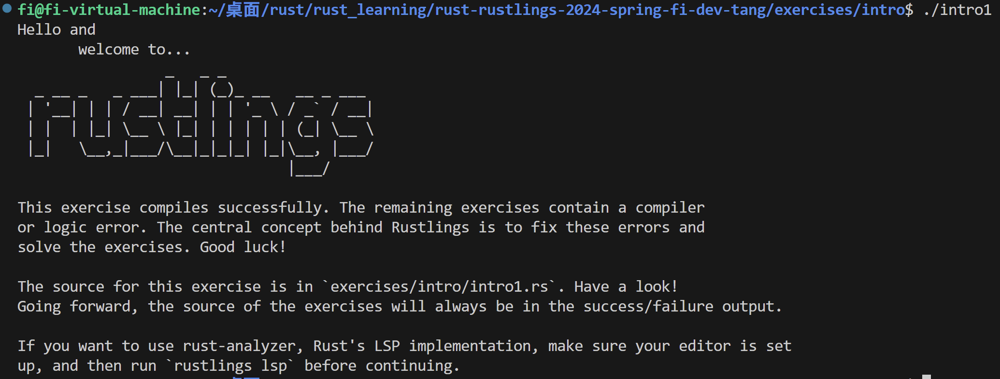

# rust_learning
记录学习rust过程中的exercise以及练习

目标: 作为初步的技能掌握，为后面的 rCore 等训练打一个基础。
## 第一阶段 —— 阶段目标: 熟练掌握 rust 语言语法
第一阶段的参考资料:
Rust语言圣经(Rust Course)

https://course.rs/about-book.html

第一阶段配套的参考习题:

https://github.com/sunface/rust-by-practice

参照了 rCore 中第一阶段验证完成度的部分，110 道 rustling 习题

https://github.com/LearningOS/rust-rustlings-2024-spring-fi-dev-tang

目前已经安装到本地，现在的计划是 Rust语言圣经 or Rustlings 练习作为每天的日常。

## 2024/6/27 摸索 rustlings 的执行方式
目前的经验是, 在 rust-rustlings-2024-spring-fi-dev-tang 目录下执行
```bash
rustlings watch
```
显示待解决的问题

```bash
rustlings list
```
可以显示当前待测的练习

对于编译情况，这里并没有按照 cargo 项目的格式进行打包，测试运行可以直接按照
```bash
rustc intro1.rs
./intro1
```
得到结果。



现在分成两个学习教程，以 Rust 语言圣经为主，同时兼顾 Rust-by-example 中的完整代码程序。

更新遇到的第一个问题，在尝试修改 match(setting_value, new_setting_value) 时，试图修改其为带有引用类型的函数。
```rust
fn customized_change(mut setting_value: &mut Option<i32>, new_setting_value: &mut Option<i32>){
    //...
    setting_value = new_setting_value;
}
```
在 setting_value 之前加入 mut, 使其成为可以修改指针指向的引用，
这个引用指向的位置直接变成了 new_setting_value 所指向的位置。
但一般来说，match(setting_value, new_setting_value) 作为模式匹配，并不完全能够进行交换（涉及到所有权改变）。
解决方案和讨论中，提到了两种正确的通过引用修改值的方法。
在新建的 /problem 文件夹下有所展示。

新增一个关注的教程: 在 Rust course 2.9.1 Vector 提到了
《Rust 秘典(死灵书)》 中对 std::vec::Vec<T> 的手动实现，相关coding记录在 rust_basis/2.9_collections/rust_pure_white 目录下

(2024/09/25) 更新情况: 留了一个坑等待填完，这个坑是手动实现《Rust 秘典(死灵书)》里关于 vector 的实现，有空的时候再补起来。
现在需要用到 rust 里面关于多线程和异步的部分，先增加这部分的info。